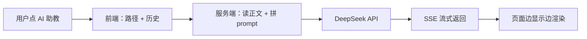

## 背景

Wiki 和博客文章越写越多，读者（也包括我自己）经常想「这段能不能再解释一下」「帮我出几道题」。接一个大模型做**页面助教**，比跳转到外部聊天工具顺手得多。

## 一分钟看懂

整条链路可以概括成 **五步**：

1. **用户在哪一页，就带哪一页的路径** — 前端不传正文，只传 `pagePath` 和聊天记录。
2. **服务端按路径读 Markdown** — Wiki / 博客从 `content/` 里取原文，拼进 system prompt。
3. **调 DeepSeek 生成回答** — API Key 只在服务端，用户用 Wiki 编辑密码进门禁。
4. **SSE 流式推回浏览器** — 字一个个出来，体验和 ChatGPT 类似。
5. **对话按页存在本地** — 换文章换历史，刷新同一页还能接着聊。

用一张图看数据怎么走：



三个设计原则，一眼能记住：

| 原则 | 做法 |
|------|------|
| 正文在服务端读 | 前端不上传内容，防篡改、省得拼 prompt |
| Key 不落地客户端 | `DEEPSEEK_API_KEY` 只配在服务器环境变量 |
| 助教不绑死本文 | 有正文时优先参考，无关问题也能自由答 |

下面展开各环节的实现细节。

## 技术要点

### 整体架构

```text
用户浏览器                         Nuxt 服务端                    DeepSeek API
──────────                        ───────────                    ────────────
WikiAiPanel.vue
  │  pagePath + messages
  │  + password
  └──────── POST /api/ai/chat ──► chat.post.ts
                                    │
                                    ├─ assertWikiPassword()
                                    ├─ getSitePageContext()  ← 读 content/wiki|blog/*.md
                                    ├─ buildPageAiSystemPrompt()
                                    └─ createDeepSeekChatStream() ──► /v1/chat/completions
                                         │
                                         ◄── SSE data: {...} ──────────┘
                                    │
  readAiChatStream() ◄── text/event-stream
  边收边渲染
```

前端只传 `pagePath`、`messages`、`password`（和可选的 `deepThink`）。**正文从不由前端上传**，避免被篡改，也省得在客户端拼 prompt。

### 页面上下文：路由 → pageKey

`composables/useAiPageContext.ts` 根据当前路由生成上下文：

| 页面类型 | pageKey 示例 | 说明 |
|----------|--------------|------|
| Wiki 文章 | `wiki:algorithm/start` | slug 经 `normalizeWikiSlug` 规范化 |
| 博客文章 | `blog:my-post` | 排除 `/blog/tag/`、`/blog/archive/` 列表页 |
| 其他页面 | `route:/tech/ref` | 无 Markdown 正文时走通用回答 |

`pageKey` 同时用于 **localStorage 会话隔离**：同一篇文章的多轮对话存在 `site-ai-session:{pageKey}` 里，换页自动切换历史。

### 服务端读正文

`server/utils/site-page-body.ts` 的 `getSitePageContext()` 是核心：

1. **Wiki**：走已有的 `getWikiPageBody`，读 `content/wiki/*.md`，去掉 front matter
2. **博客**：用 `@nuxt/content` 的 `serverQueryContent` 查 `_path`，再读本地 `.md` 原文；正文过长截断到 12_000 字符
3. **其他页**：只返回路径说明，system prompt 里会告诉模型「没有可引用正文，自由作答」

博客有个小坑：文件名带日期前缀（如 `2026-07-08-foo.md`），URL slug 可能是 `foo`。查询时用正则兼容两种 `_path`，`pageKey` 统一去掉日期前缀，否则 AI 读不到正文。

### System Prompt 设计

`server/utils/deepseek.ts` 里的 `buildPageAiSystemPrompt()` 负责「助教人格」：

- 明确身份：本站接入的 DeepSeek，不是 ChatGPT / Claude 本体
- 有正文时：**参考**当前页内容，相关题优先结合正文，但不强制所有回答都来自本文
- 无正文时：当通用助手
- 「考考我」：有正文则基于正文出题，否则按对话主题出题
- 要求 Markdown 输出、语言与用户一致

这样比「你只能回答本文内容」灵活，实际好用很多。

### 聊天 API 与 SSE 流式

入口是 `server/api/ai/chat.post.ts`：

1. 校验密码（复用 Wiki 的 `assertWikiPassword`）
2. 解析 `messages`，最多保留最近 24 条
3. 调用 DeepSeek `stream: true`
4. 把上游 SSE 解析后，以统一格式转发给前端：

```json
{ "type": "meta", "pageKey": "...", "title": "..." }
{ "type": "delta", "content": "你" }
{ "type": "delta", "content": "好" }
{ "type": "done" }
```

响应头设 `Content-Type: text/event-stream`、`X-Accel-Buffering: no`，避免 Nginx 缓冲把流式弄成一次性返回。

前端 `utils/ai-stream.ts` 的 `readAiChatStream()` 按 `\n\n` 切事件，逐段追加到 assistant 消息；流式过程中用纯文本 + 光标，结束后再用 markdown-it 渲染历史消息。

勾选「深度思考」时切换模型为 `deepseek-reasoner`，否则用环境变量里的 `DEEPSEEK_MODEL`（默认 `deepseek-chat`）。

### 前端 UI：WikiAiPanel

`components/WikiAiPanel.vue` 挂在 `app.vue` 的 `<ClientOnly>` 里，全站一个实例：

- 桌面：右下角「AI 助教」悬浮钮
- 移动：收入 `⋯` 快捷操作面板（`useMobileFabActions` 注册 opener，避免和回到顶部、Wiki 目录抢位置）
- 弹框内：多轮聊天、「考考我」「总结要点」快捷 chip、可选深度思考
- 遮罩关闭用 `pointerdown/up.self`，避免拖选文字误关窗

打开面板时，若 localStorage 里有 24 小时内有效的编辑密码，会自动调 `/api/wiki/verify` 静默解锁。

### 密码与本地会话

AI 和 Wiki 编辑共用同一套密码（`WIKI_PASSWORD` 环境变量）。`utils/wiki-edit-password.ts` 在客户端记 24 小时 TTL，减少重复输入。

会话存在 `utils/ai-session.ts`：

```ts
localStorage.setItem(`site-ai-session:${pageKey}`, JSON.stringify({
  pageKey,
  title,
  updatedAt,
  messages,
}))
```

路由变化时 `watch` 重新 `loadSession()`，同一页刷新也能续聊。

### 环境变量

```bash
DEEPSEEK_API_KEY=sk-xxx          # 必填
WIKI_PASSWORD=你的编辑密码          # AI 与 Wiki 编辑共用
DEEPSEEK_MODEL=deepseek-chat       # 可选
DEEPSEEK_BASE_URL=https://api.deepseek.com  # 可选
```

在 `nuxt.config.ts` 的 `runtimeConfig` 里读取，**不要**把 Key 暴露到 `public`。

### 相关文件速查

| 文件 | 职责 |
|------|------|
| `components/WikiAiPanel.vue` | 悬浮钮、弹框、发消息、流式展示 |
| `composables/useAiPageContext.ts` | 路由 → pageKey / pagePath |
| `server/api/ai/chat.post.ts` | SSE 聊天接口 |
| `server/utils/deepseek.ts` | DeepSeek 调用 + system prompt |
| `server/utils/site-page-body.ts` | 按路径读 Wiki/博客正文 |
| `utils/ai-session.ts` | 按页本地会话 |
| `utils/ai-stream.ts` | 解析 SSE 事件 |
| `app.vue` | 全站挂载 + 移动端快捷入口 |

旧接口 `server/api/wiki/ai/chat.post.ts`（非流式）已标记 deprecated，新代码统一走 `/api/ai/chat`。

### 后续可做的

当前 v1 已够用，若要上线给更多人用，还可以考虑：

- 接口限流（按 IP 或密码维度）
- 非 Markdown 页面抓取可见 DOM 正文
- 会话 TTL 与「清空全部历史」
- 部署文档里单独写一节 AI 相关 env

---

如果你也在 Nuxt 内容站里接助教，核心就三件事：**服务端读正文、服务端持 Key、前端只管对话 UI**。先把这条链路跑通，再谈 RAG、工具调用也不迟。
